Rasterizer and Shader Toy Fun
==================================

**University of Pennsylvania, CIS 560: Introduction to Computer Graphics**

* Bowen Deng
  * [LinkedIn](www.linkedin.com/in/bowen-deng-7dbw13)

## Abstract

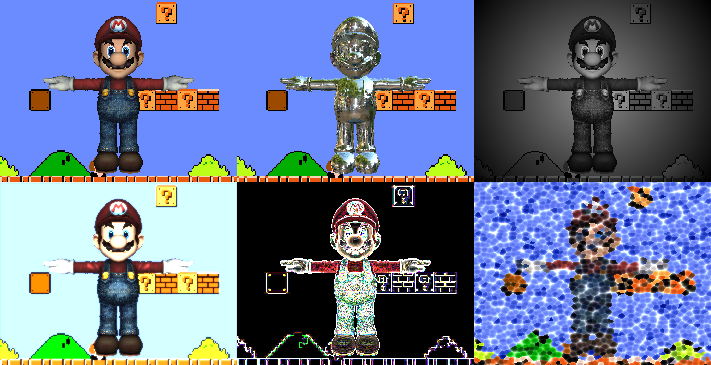

This project includes two parts of work. One is a C++ based rasterizer, which is capable for rendering 3D objects with multiple reflection models. Another one works with OpenGL, and utilizes different vertex and fragment shaders to achieve interesting visual effects.

## Rasterizer

### Basic Functionality

For a 3D object loaded from OBJ files, firstly it will be projected to the screen through the model-view-projection transformation. Then the rasterizer performs triangulation on its faces, and scans line by line to determine where such triangles start and end at each line. The color of a pixel is computed by barycentric interpolation.

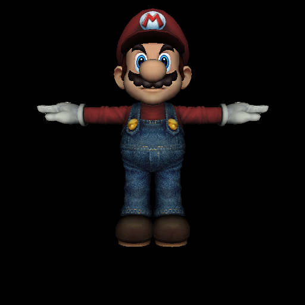

### Reflection Model

Several kinds of refection models are embedded.

- **Line Rendering**

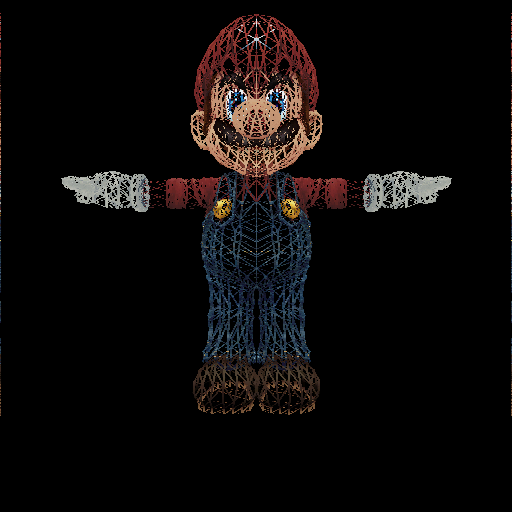

- **Blinn-Phong Model**

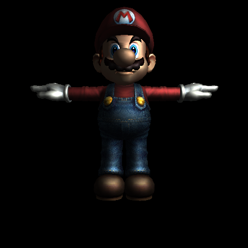

- **Lit Sphere Model**

- **Toon Model**

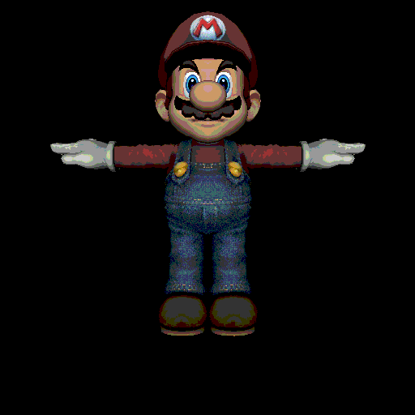

------------------------------------------------------------------------------------------

## Shader

### Interactive Camera

A polar spherical camera is applied to provide interactive controls.

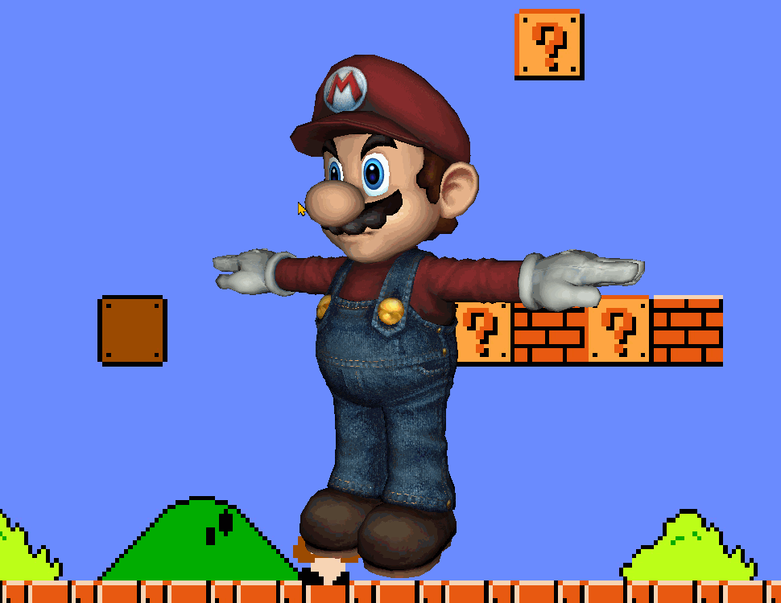

### Surface Shaders

Some interesting shading achieved with vertex shaders.

- **Blinn-Phong Reflection Shader**

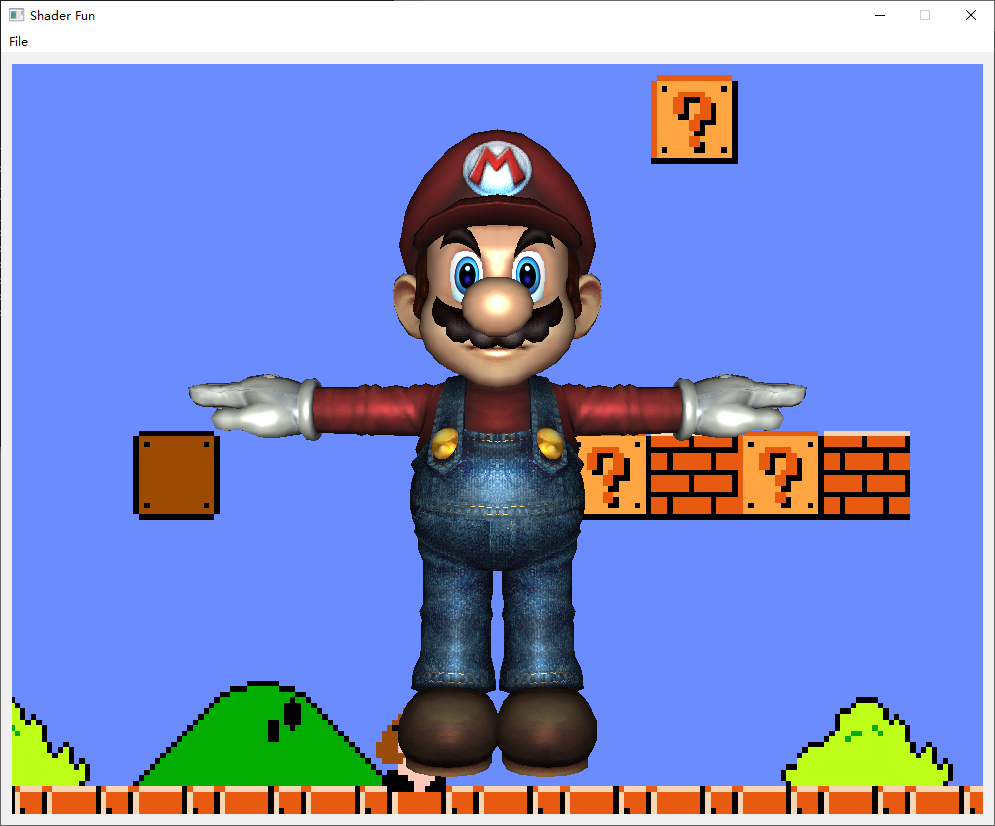

- **Matcap Reflection Shader**

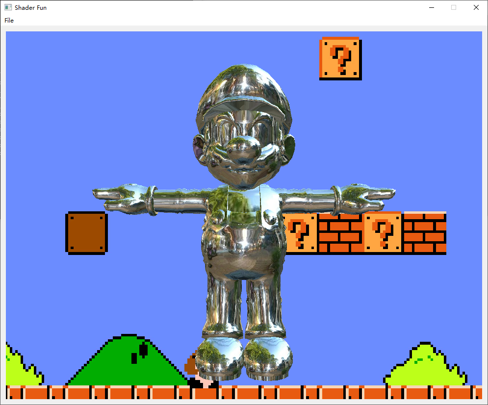

- **Iridescent Shader**

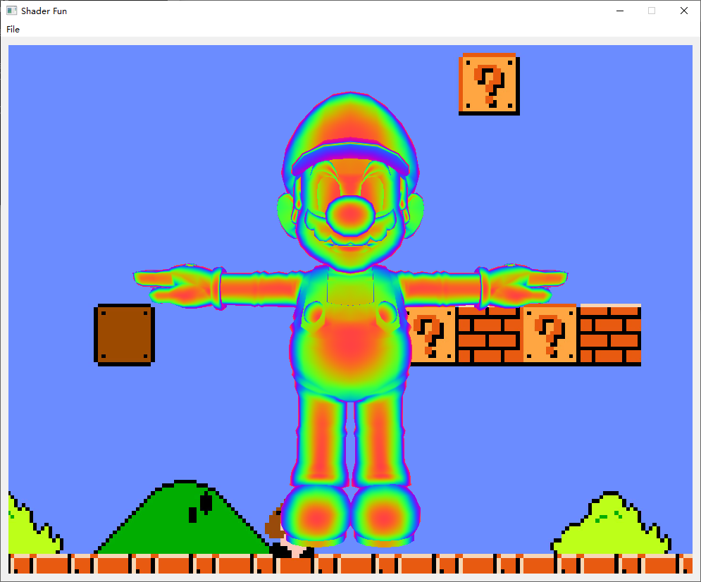

- **Deformation shader**

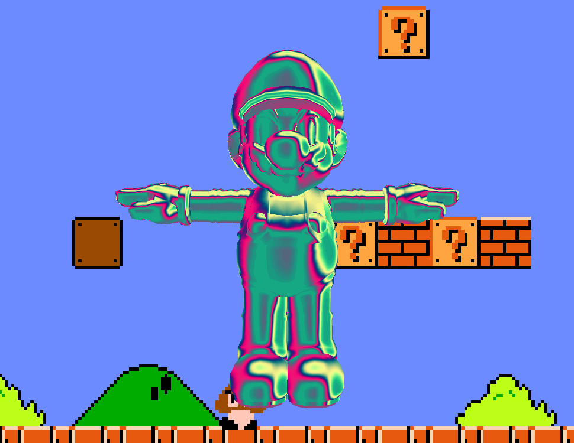

### Post-Process Shaders

Cool effects made with fragment shaders.

- **Greyscale and vignette Shader**

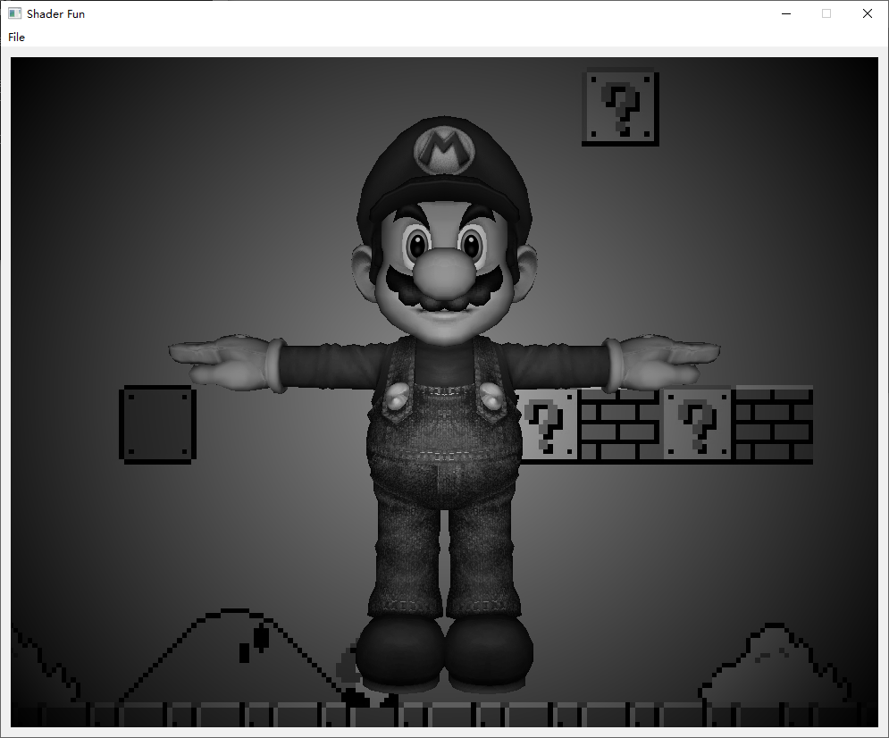

- **Gaussian Blur Shader**

- **Sobel Filter Shader**

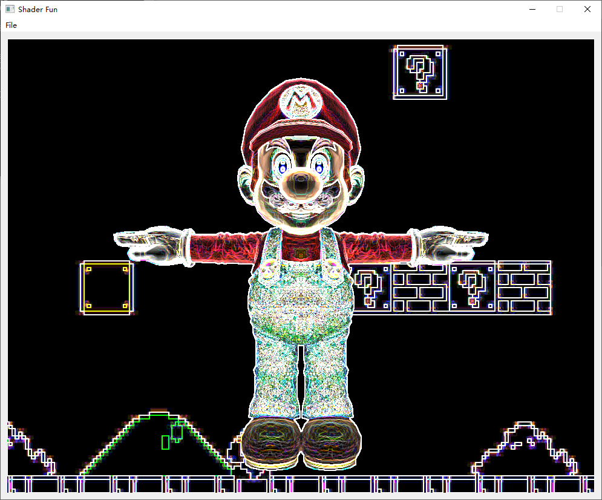

- **Bloom Shader**

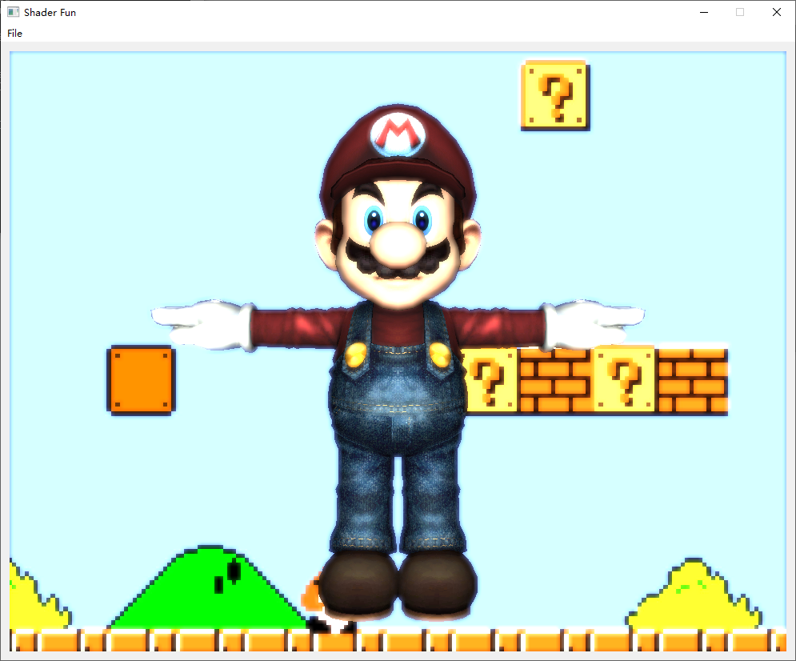

- **Worley Noise-Based Shader**

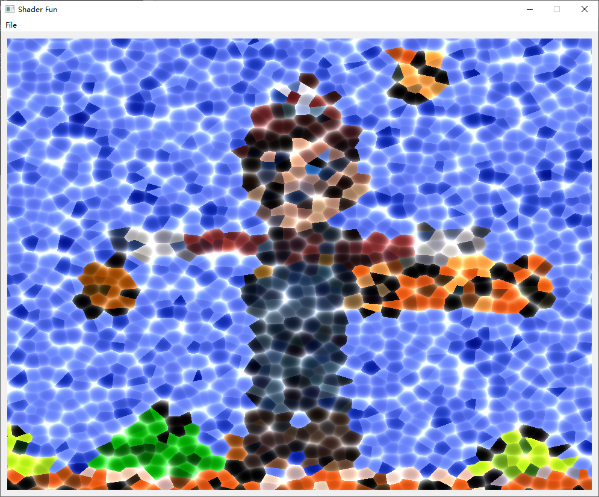

### Shader Combination

Of course, the surface shaders and post-process shaders can be combined to create more crazy results!

